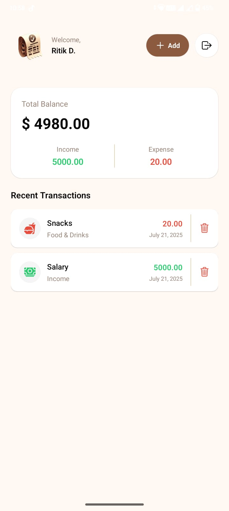
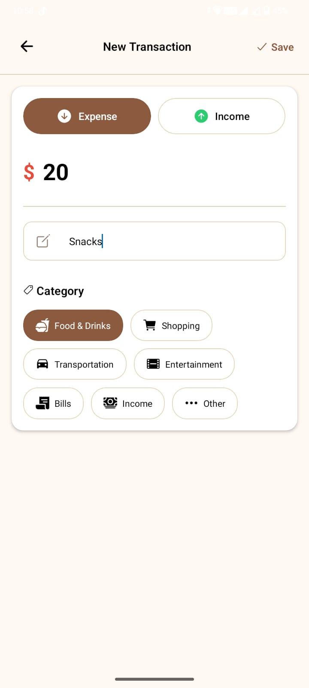

# Walt

Walt is a personal finance management app with a mobile frontend (React Native/Expo) and a backend powered by Node.js, GraphQL, and Clerk authentication.

## Features

- Secure authentication with Clerk
- Track income and expenses
- Categorize transactions
- View transaction history and summaries

## Screenshots

<div align="center">
  
  
  
</div>

## Technologies

- **Node.js** (v18+ recommended)
- **npm** (v9+ recommended)
- **React Native** (Expo)
- **GraphQL** (GraphQL.js)
- **Prisma** (ORM for backend)
- **Clerk** (Authentication)
- **Hono** (Backend framework)
- **PostgreSQL** (Database, configurable via Prisma)

## Getting Started

### Backend

1. Install dependencies:
   ```bash
   cd server
   npm install
   ```
2. Set environment variables in `.env` (see `server/src/configs/app.js` for required keys).
3. Start the server:
   ```bash
   npm start
   ```

### Mobile App

1. Install dependencies:
   ```bash
   cd mobile
   npm install
   ```
2. Start Expo:
   ```bash
   npx expo start
   ```

## Folder Structure

```
walt/
├── mobile/      # React Native app
├── server/      # Node.js GraphQL backend
├── media/       # Screenshots and images for README
```
